# Langevin-algorithms-for-deep-stochastic-control
Implementation of the paper [Langevin algorithms for Markovian Neural Networks and Deep Stochastic control](https://arxiv.org/abs/2212.12018) in pytorch.

Inspired by the work of [Pierre Bras,Ph.D.](https://github.com/bras-p/langevin-for-stochastic-control)

## Framework
### Stochastic Optimal Control

We use the regular continuous-time finite-horizon SOC framework and notations, so that our optimization problem reads:

$$
\min_u J(u) := \mathbb{E} \left[ \int_0^T G(t, X_t) \, dt + F(X_T) \right]
$$

subject to the stochastic differential equation:

$$
\begin{cases}
    dX_t = b(X_t, u_t) \, dt + \sigma(X_t, u_t) \, dW_t, & t \in [0, T] \\
    X_0 = x_0
\end{cases}
$$

where $b: \mathbb{R}^{d_1} \times \mathbb{R}^{d_3} \rightarrow \mathbb{R}^{d_1}, \sigma: \mathbb{R}^{d_1} \times \mathbb{R}^{d_3} \rightarrow \mathcal{M}_{d_1, d_2}(\mathbb{R}), W$ is a $\mathbb{R}^{d_2}$-valued Brownian motion and $u$ is a $\mathbb{R}^{d_3}$-valued continuous adapted process, $T>0, G:[0, T] \times \mathbb{R}^{d_1} \rightarrow \mathbb{R}$ and $F: \mathbb{R}^{d_1} \rightarrow \mathbb{R}$.

The process $\left(X_t\right)_{t \in[0, T]}$ is approximated through the Euler-Maruyama scheme, and likewise the control $u_t$ is replaced by its discrete-time counterpart. We consider the regular subdivision of $[0, T]$:
    $$\begin{align*}
        t_k:=k T / N, \quad k \in\{0, \ldots, N\}, \quad h:=T / N   % h est introduit mais jamais utilisé
    \end{align*}$$ 

and we approximate the control applied at times $t_0, \ldots, t_{N-1}$ either as the output of a single neural network depending on $t$, or as the output of $N$ neural networks, one for each discretization instant $t_k$ :
$$
u_{t_k}=\bar{u}_\theta\left(t_k, X_{t_k}\right) \quad \text { or } \quad u_{t_k}=\bar{u}_{\theta^k}\left(X_{t_k}\right)
$$
where $\bar{u}_\theta$ is a neural function with finite-dimensional parameter $\theta \in \mathbb{R}^d$. Indeed, since $(X_t)_{t\in [0,T]}$ a Markovian process, we can assume that $u_t$ depends only on $t$ and on $X_t$ instead of $t$ and $\left(X_s\right)_{s \in[0, t]}$.

The SOC problem is thus approximated by
  $$  \begin{align}
& \min _\theta \bar{J}\left(\bar{u}_\theta\right) := \mathbb E \left[\sum_{k=0}^{N-1}\left(t_{k+1}-t_k\right) G\left(t_{k+1}, \bar{X}_{t_{k+1}}^\theta\right)
+ F\left(\bar{X}_{t_N}^\theta\right)\right] \\
&\mathrm{s.t.}\quad \begin{cases}
    \bar{X}_{t_{k+1}}^\theta = \bar{X}_{t_k}^\theta
    + \left(t_{k+1}-t_k\right) b\left(\bar{X}_{t_k}^\theta, \bar{u}_{k, \theta}\left(\bar{X}_{t_k}^\theta\right)\right) 
    + \sqrt{t_{k+1}-t_k} \sigma\left(\bar{X}_{t_k}^\theta, \bar{u}_{k, \theta}\left(\bar{X}_{t_k}^\theta\right)\right) \xi_{k+1} \\
    \xi_{k} \sim \mathcal{N}\left(0, I_{d_2}\right) \\
    \bar{X}_{t_0}^\theta = x_0
\end{cases} 
    \end{align}$$

The SGD algorithm reads
    $$\begin{align}
        \theta_{n+1}=\theta_n-\gamma_{n+1} \frac{1}{n_{\text {batch }}} \sum_{i=1}^{n_{\text {batch }}} \nabla_\theta \bar{J}\left(\bar{u}_{\theta_n},\left(\xi_k^{i, n+1}\right)_{1 \leq k \leq N}\right)=: \theta_n-\gamma_{n+1} g_{n+1}
    \end{align}$$
where $\left(\xi_k^{i, n}\right)_{1 \leq k \leq N, 1 \leq i \leq n_{\text {batch }}, n \in \mathbb{N}}$ is an array of i.i.d. $\mathcal{N}\left(0, I_{d_2}\right)$-distributed random vectors, $\left(\gamma_n\right)_{n \in \mathbb{N}}$ is a nonincreasing positive step sequence and where the dependence of $\bar{J}$ in $\left(\xi_k^{i, n}\right)$ is made explicit. 

### Adaptive Langevin optimizers

We use the popular preconditioned variations of SGD Adam [1](#ref1), RMSprop [2](#ref2), and Adadelta [3](#ref3). We also study an adaptively preconditionned version of SGD with momentum introduced in [4](#ref4) and a Langevin adaptation of Adagrad. Just like in the original paper, the Langevin version of an algorithm is $L-\textit{name}$, the gradient update thus reads:
$$\begin{align}\theta_{n+1} = \theta_n - \gamma_{n+1} P_{n+1}\cdot g_{n+1} + \sigma_{n+1}\sqrt{\gamma_{n+1}} \mathcal N\left(0, P_{n+1}\right)\end{align}$$

Where $(P_n)_n$ is the preconditioner, $(g_n)_n$ is the gradient estimate as defined bellow, $(\gamma_n)_n$ is the learning rate schedule and $(\sigma_n)_n$ is the noise scale schedule.

We also test the $p\%$ Layer Langevin algorithm introduced in [5](#ref5), which injects noise only to the first $p\%$ layers of the network.

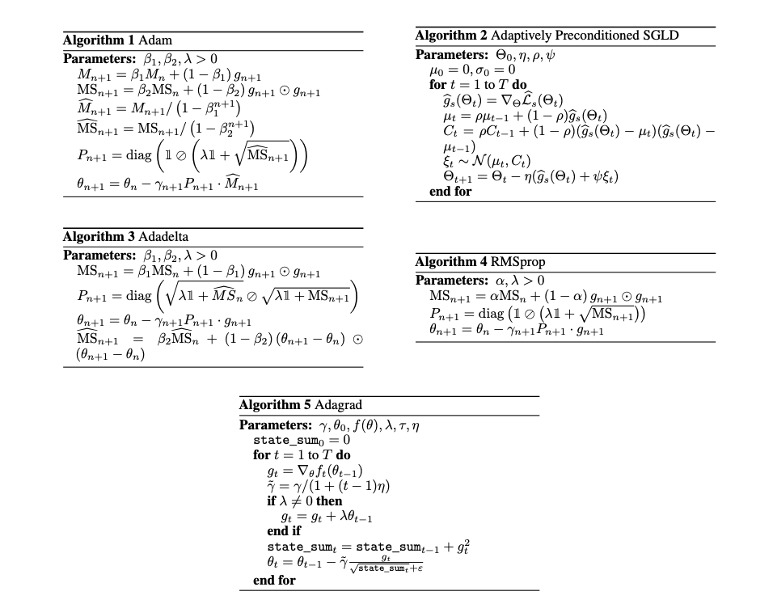

### Numerical setting and implementation
We reproduce all the experiments displayed in [6](#ref6) , while testing additional settings in an attempt to be as thourough as possible. We kept the same batch size of $n_{\text{batch}} = 512$. Each epoch is trained on $5$ batches and evaluated on $25$ batches. We also plot the corresponding $95\%$ confidence intervals for $J(u_\theta)$ even when too small to be perceived. For our results to make sense, we made sure to initialize the weights to the exact same values when comparing different algorithms. A **torch.Generator** instance is created, using a seed that can be passed as an argument in the control configuration, during the call of the network class. We initialized all weights from a $\mathcal N(0, 0.1)$ just like in the paper, except for the $w$ parameter in the deephedging problem which was initialized to zero. Other more sophisticated initializations, like the Xavier initialization, are possible with our implementation but were not tested.

The original paper already has an implementation in **tensorflow** but we chose to implement our optimizers in **pytorch** as we are more familiar with this framework. We built upon the official **pytorch** implementation of the different optimization algorithms. For the SOC problems, we went with a similar structure to that of the original repository. An SOC problem has to be a child class of **DeepControledDiffusion**. This base class implements many abstract methods, the most important being **objective**, that takes as an argument an integer $\texttt{batch\_size}$ and returns a **torch.Tensor** containing the values of $J(u_\theta)$ for the different trajectories. We then use this tensor for the backward pass, and increment the weights of our networks using our optimizers. We also had to implement a custom learning rate scheduler that acts on the $\sigma$ parameter. We attempted our numerical experiments using the same hyperparameters as the original papers, except in some cases where we found that the suggested values of $\sigma$ were too high, leading to instability and divergence of our algorithms.

## Stochastic optimal control
### Fishing quotas

In this problem, we model the fish biomass $X_t\in\mathbb R^{d_1}$ by the following diffusion : 
$$dX_t = X_t \odot \left( (r - u_t - \kappa X_t)\,dt + \eta dW_t\right), \quad t\in [0, T]$$ 

Where $u_t\in\mathbb R^{d_1}$ represents the control, and is contrained within $[u_m, u_M]^{d_1}$. We wish to keep the biomass close to a target value $\mathcal X_t\in\mathbb R^{d_1}$. The objective is defined as follows :
$$J(u) := \mathbb E\left[\int_0^T\left(\left|X_t - \mathcal X_t\right|^2 - \langle \alpha, u_t\rangle\right)\,dt + \beta \left[u\right]^{0, T}\right]$$
The quantity $\left[u\right]^{0, T}$ is the quadratic variation of the $u$ and is approximated via $\left[u\right]^{0, T}\approx \sum_{k=0}^{N-1}\left|u_{t_{k+1}} - u_{t_k}\right|^2$. We worked in the same setting as the original paper:
$$d_1 = d_2 = 5, \;T=1,\;\mathcal X = 1_{\mathbb R^5}, \; r=2\times 1_{\mathbb R^5}, \; \eta=0.1\times I_5, \; \alpha = 0.01\times 1_{\mathbb R^5}, \; \beta = 0.1, \; u_m=0.1, \; u_M = 1.$$
and :
$$\kappa = \begin{bmatrix}
1.2 & -0.1 & 0 & 0 & -0.1 \\
0.2 & 1.2 & 0 & 0 & -0.1 \\
0 & 0.2 & 1.2 & -0.1 & 0 \\
0 & 0 & 0.1 & 1.2 & 0 \\
0.1 & 0.1 & 0 & 0 & 1.2 
\end{bmatrix}$$

For more details on the problem, see [7](#ref7).

| 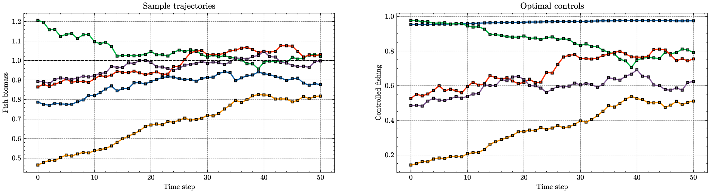 |
|:--:|
| Example of a sample controlled trajectory for $N=50$, on the left we see the components of $X_t\in\mathbb R^5$ and on the right $u_t\in\mathbb R^5$. The objective biomass $\mathcal X_t = 1_{\mathbb R^5}$ is drawned using a dotted horizontal black line. The inital state $X_0$ is sampled from $\mathcal N\left(1_{\mathbb R^5}, 0.5 I_5\right)$ that is then clipped to $[0.2, 2]^5.$ |

#### Single control

We first train a single control $u_\theta : \mathbb{R}_+ \times \mathbb{R}^5 \to \mathbb{R}^5$ 
given by a two-layer feedforward network, each layer containing $32$ hidden units and activated 
by a ReLU function. The output is passed through a sigmoid function to ensure constraints on $u$. 
We train each algorithm for $N=30, 50, 100$ and plot the test loss for the vanilla algorithm 
against the Langevin version.

| 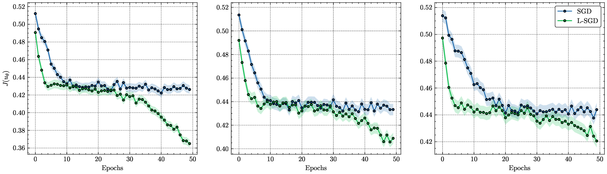 |
|:--:|
| **Comparison of SGD and L-SGD with momentum $=0.9$ for $N=30, 50, 100$ over 50 epochs.** The schedules are $\gamma_n =5e-2$ and $\sigma_n=1e-3$ between epochs 0 and 40, after which $\gamma_n$ is divided by 10 and $\sigma$ set to 0. |

This example showcases the exploration capacity of Langevin dynamics, as we see both algorithms 
trapped in a local minimum. Thanks to the injected noise, the Langevin algorithm navigates the 
loss landscape better and escapes this point. Improvements are even more significant in the 
following algorithms.

| 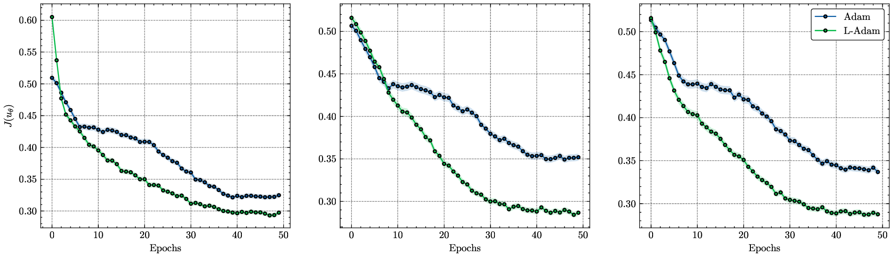 |
|:--:|
| **Comparison of Adam and L-Adam for $N=30, 50, 100$ over 50 epochs.** The schedules are $\gamma_n =2e-3$ and $\sigma_n=1e-3$ between epochs 0 and 40, after which $\gamma_n$ is divided by 10 and $\sigma$ set to 0. |

| 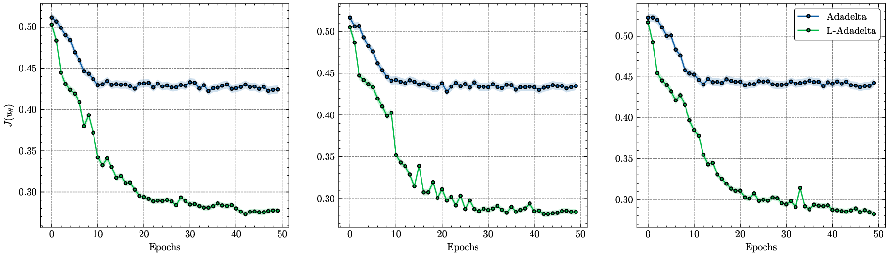 |
|:--:|
| **Comparison of Adadelta and L-Adadelta for $N=30, 50, 100$ over 50 epochs.** The schedules are $\gamma_n =5e-1$ and $\sigma_n=1e-2$ between epochs 0 and 40, after which $\gamma_n$ is divided by 10 and $\sigma$ set to 0. |

| 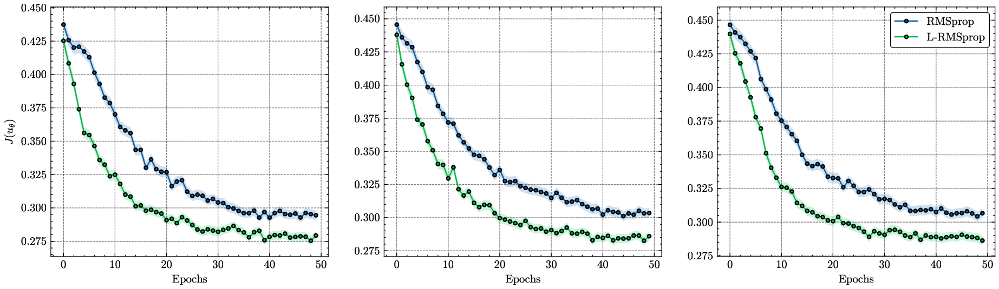 |
|:--:|
| **Comparison of RMSprop and L-RMSprop for $N=30, 50, 100$ over 50 epochs.** The schedules are $\gamma_n =2e-3$ and $\sigma_n=5e-3$ between epochs 0 and 40, after which $\gamma_n$ is divided by 10 and $\sigma$ set to 0. |

| 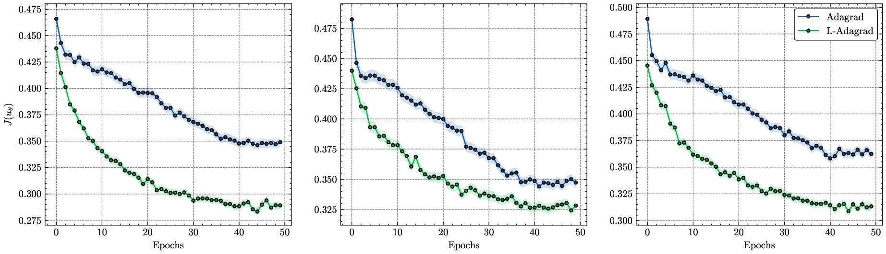 |
|:--:|
| **Comparison of Adagrad and L-Adagrad for $N=30, 50, 100$ over 50 epochs.** The schedules are $\gamma_n =1e-2$ and $\sigma_n=5e-5$ between epochs 0 and 40, after which $\gamma_n$ is divided by 10 and $\sigma$ set to 0. |

Clearly, Langevin algorithms converge faster than their vanilla counterparts for the fishing quotas 
problem. More significant gains are also seen in the case of RMSprop compared to the original paper.

#### Multiple controls

We now train multiple controls $(u_{\theta_k})_{0\leq j \leq N}$, one for each discretization step. 
We compare all algorithms with their Langevin and $p\%$ Layer Langevin versions for $p=30, 90$ and 
$N=10, 20, 40$, respectively.

| 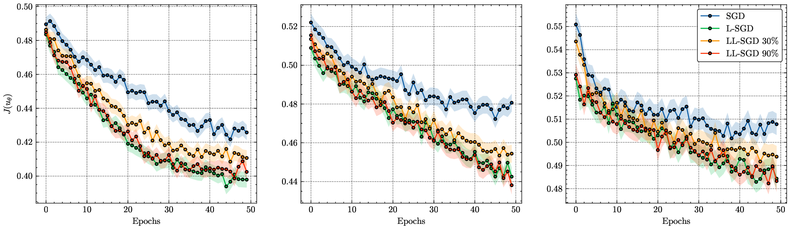 |
|:--:|
| **Comparison of SGD, L-SGD, and LL-SGD with momentum $=0.9$ for $N=10, 20, 40$ over 50 epochs.** The schedules are $\gamma_n =5e-2$ and $\sigma_n=2e-3$ between epochs 0 and 40, after which $\gamma_n$ is divided by 10 and $\sigma$ set to 0. |

| 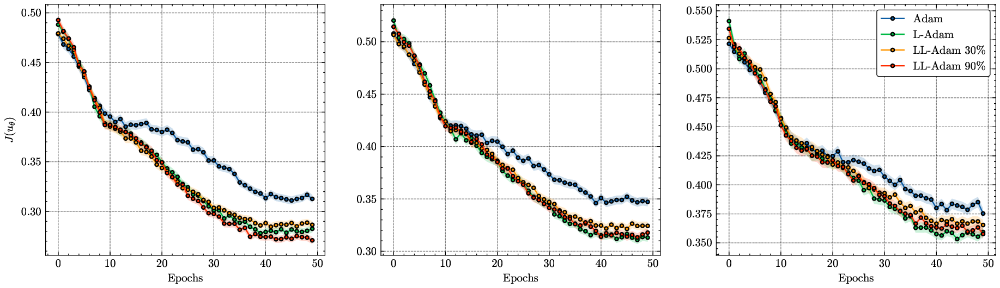 |
|:--:|
| **Comparison of Adam, L-Adam, and LL-Adam for $N=10, 20, 40$ over 50 epochs.** The schedules are $\gamma_n =2e-3$ and $\sigma_n=2e-4$ between epochs 0 and 40, after which $\gamma_n$ is divided by 10 and $\sigma$ set to 0. |

| 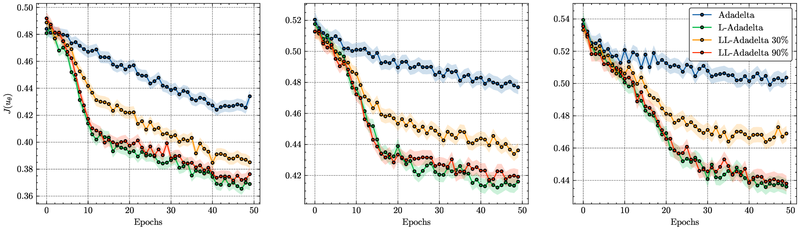 |
|:--:|
| **Comparison of Adadelta, L-Adadelta, and LL-Adadelta for $N=10, 20, 40$ over 50 epochs.** The schedules are $\gamma_n =5e-1$ and $\sigma_n=5e-3$ between epochs 0 and 40, after which $\gamma_n$ is divided by 10 and $\sigma$ set to 0. |

| 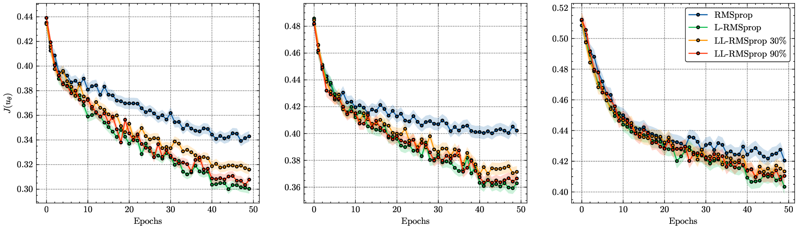 |
|:--:|
| **Comparison of RMSprop, L-RMSprop, and LL-RMSprop for $N=10, 20, 40$ over 50 epochs.** The schedules are $\gamma_n =2e-3$ and $\sigma_n=2e-3$ between epochs 0 and 40, after which $\gamma_n$ is divided by 10 and $\sigma$ set to 0. |

| 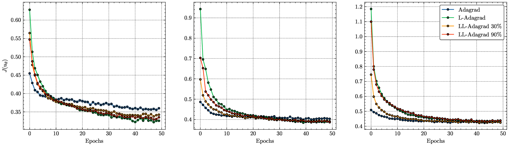 |
|:--:|
| **Comparison of Adagrad, L-Adagrad, and LL-Adagrad for $N=10, 20, 40$ over 50 epochs.** The schedules are $\gamma_n =1e-2$ and $\sigma_n=5e-5$ between epochs 0 and 40, after which $\gamma_n$ is divided by 10 and $\sigma$ set to 0. |

As seen in the fishing quotas problem, the Langevin Layer algorithm does not improve significantly 
over regular Langevin algorithms, with the performance only improving when increasing the percentage 
of noisy layers.

### Deep hedging

In this problem, we aim to replicate a $\mathcal{F}_T$-measurable payoff $Z$ on a portfolio 
$S_t\in\mathbb{R}^{d_1}$. The control $u_t\in\mathbb{R}^{d_1}$ represents the amount held at time 
$t$ of each asset. The objective is:

$$
J(u, w) := \mathbb{E}\left[w + l\left(Z - \sum_{k=0}^{N-1} \left\langle u_{t_k}, 
S_{t_{k+1}} - S_{t_k}\right\rangle + \sum_{k=0}^{N-1} \left\langle c_{t_r}S_{t_k}, 
\left|u_{t_k} - u_{t_{k-1}}\right|\right\rangle - w \right)\right]
$$

where $l: \mathbb{R} \to \mathbb{R}$ is a continuous, non-decreasing convex function. In our 
experiments, we consider the loss function associated with the value-at-risk, i.e., 
$l: x\mapsto (1-\alpha)^{-1}\max(x, 0)$. We assume $d_1$ is even, such that for $d'_1 = d_1 / 2$, 
the assets $(S_t^{1, i})_{1\leq i \leq d'_1} = (S_t^i)_{1\leq i \leq d'_1}$ follow $d'_1$ 
independent Heston dynamics, and $(S_t^{2, i})_{1\leq i \leq d'_1} = (S_t^i)_{d'_1 +1\leq i \leq d_1}$ 
are the corresponding variance swaps:

$$
\begin{cases}
dS_t^{1, i} = \sqrt{V_t^i} S_t^{1, i} \,dB^i_t\;,\;\; S_0^{1,i} = s_0^i \\
dV_t^i = a^i(b^i - V_t^i)dt + \eta^i\sqrt{V_t^i}\,dW^i_t\;,\;\;V_0^i = v_0^i \\
d\left\langle B^i, W^i\right\rangle_t = \rho^i
\end{cases} 
$$

For the parameters:

$$
\begin{align}
& d'_1 = 5, \; T=1, \; a=1_{\mathbb{R}^5}, \;b=0.04 \times 1_{\mathbb{R}^5}, \; 
\eta = 2\times 1_{\mathbb{R}^5}, \; \rho = -0.7 \times 1_{\mathbb{R}^5}, \; 
\alpha = 0.9, \\
&s_0 = K = 1_{\mathbb{R}^5}, \; v_0 = 0.1 \times 1_{\mathbb{R}^5}, \; 
c_{t_r} = 5e-4\times 1_{\mathbb{R}^5}.
\end{align}
$$

| 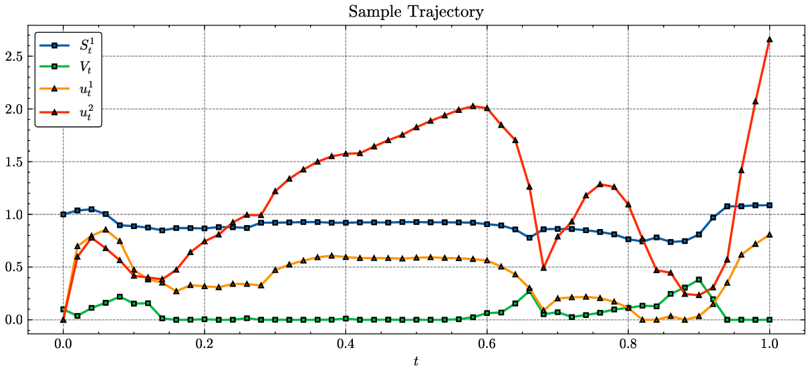 |
|:--:|
| **Example of a sample controlled trajectory for $N=50$** |

In all our experiments, the control $w$ was initialized to 0, and its optimum was reached 
using vanilla SGD with momentum 0.9, as adding Langevin noise to this single parameter wasn’t 
necessary.

#### Single control

In this problem, the control at time $t_k$ is a function of $\log(S^1_{t_k}), V_{t_k}$ and 
$u_{t_{k-1}}$. We first train a single control $u_\theta : \mathbb{R}_+ \times \mathbb{R}^{10} 
\to \mathbb{R}^{10}$ using a two-layer feedforward network with each layer containing 32 hidden 
units and ReLU activation. The output is passed through a sigmoid function to ensure constraints 
on $u$. Each algorithm is trained for $N=30, 50, 100$ respectively, and we plot the test loss 
for the vanilla algorithms and their Langevin counterparts.

| 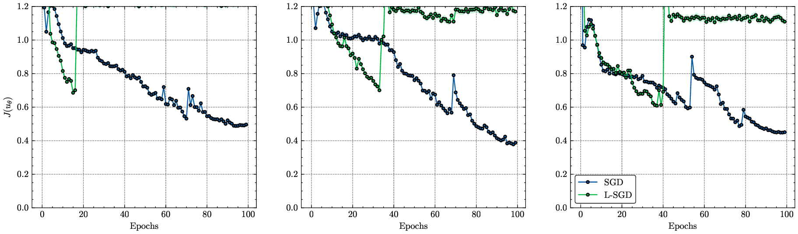 |
|:--:|
| **Comparison of SGD and L-SGD with momentum = 0.9 for $N=30, 50, 100$ over 100 epochs.** The schedules are $\gamma_n =3e-2$ and $\sigma_n=5e-5$ between epochs 0 and 80, after which $\gamma_n$ is divided by 10 and $\sigma$ set to 0. |

| 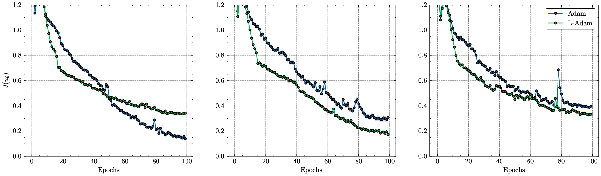 |
|:--:|
| **Comparison of Adam and L-Adam for $N=30, 50, 100$ over 100 epochs.** The schedules are $\gamma_n =2e-3$ and $\sigma_n=2e-4$ between epochs 0 and 80, after which $\gamma_n$ is divided by 10 and $\sigma$ set to 0. |

| 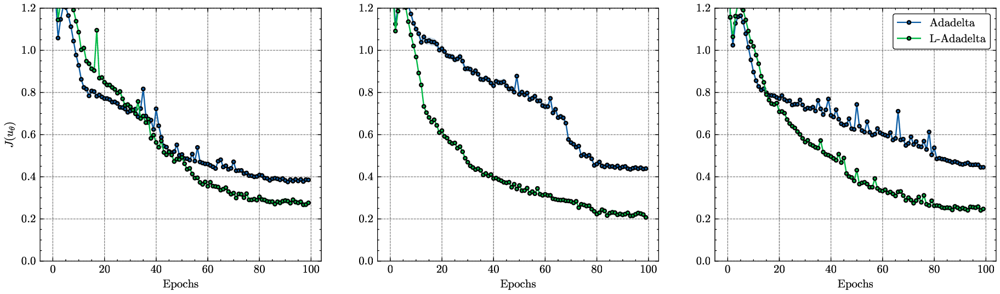 |
|:--:|
| **Comparison of Adadelta and L-Adadelta for $N=30, 50, 100$ over 100 epochs.** The schedules are $\gamma_n =5e-1$ and $\sigma_n=5e-3$ between epochs 0 and 80, after which $\gamma_n$ is divided by 10 and $\sigma$ set to 0. |

The results in this problem are largely optimizer-dependent. Langevin dynamics provide a 
significant advantage only with Adadelta and Adagrad.

#### Multiple controls

| 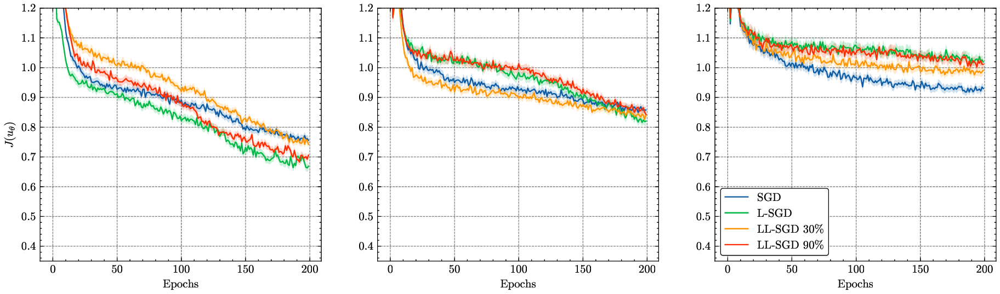 |
|:--:|
| **Comparison of SGD, L-SGD, and LL-SGD with momentum = 0.9 for $N=10, 20, 40$ over 200 epochs.** The schedules are $\gamma_n =5e-2$ and $\sigma_n=2e-3$ between epochs 0 and 180, after which $\gamma_n$ is divided by 10 and $\sigma$ set to 0. |

| 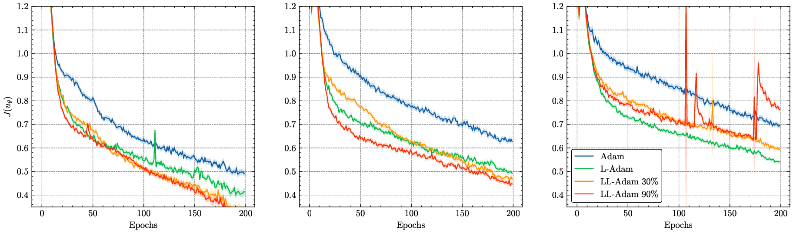 |
|:--:|
| **Comparison of Adam, L-Adam, and LL-Adam for $N=10, 20, 40$ over 200 epochs.** The schedules are $\gamma_n =2e-3$ and $\sigma_n=2e-4$ between epochs 0 and 180, after which $\gamma_n$ is divided by 10 and $\sigma$ set to 0. |

| 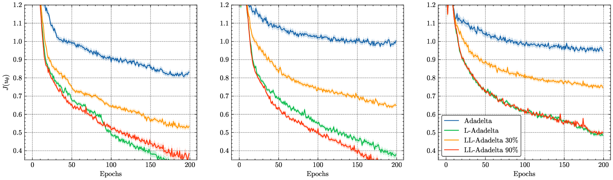 |
|:--:|
| **Comparison of Adadelta, L-Adadelta, and LL-Adadelta for $N=10, 20, 40$ over 200 epochs.** The schedules are $\gamma_n =5e-1$ and $\sigma_n=5e-3$ between epochs 0 and 180, after which $\gamma_n$ is divided by 10 and $\sigma$ set to 0. |

Langevin dynamics show a significant edge in performance, and the use of Langevin layers alone 
seems to balance computational cost and convergence speed without a clear advantage in using 
additional noisy layers.

### Oil Drilling

The oil driller balances extraction costs and storage in a volatile energy market. The oil price 
$P_t \in \mathbb{R}$ is assumed to follow a Black-Scholes process:

$$
dP_{t} = \mu P_{t} \,dt+\eta P_{t} \,dW_{t}. 
$$

The control is given by $q_{t} = (q_{t}^v, q_{t}^s, q_{t}^{v, s}) \in \mathbb{R}^3$ with constraints 
on $q_{t}^v$ (extracted oil immediately sold), $q_{t}^s$ (stored), and $q_{t}^{v, s}$ (sold per 
time unit). The extraction and storage costs are given by $c_{e} (E_{t})$ and $c_{s} (S_{t})$:

$$
c_{e} (E_{t})=\exp \left( \xi_{e} E_{t} \right), \quad c_{s} (S_{t})=\exp \left( \xi_{s} S_{t} \right)-1.
$$

| 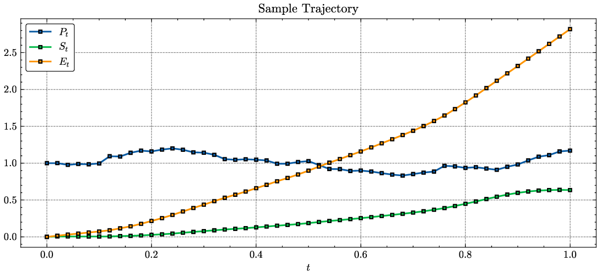 |
|:--:|
| **Example of a sample controlled trajectory for $N=50$** |

The control $q_{t}$ is given by a feedforward neural network with two hidden layers with 32 units 
and ReLU activation while the output layer has ReLU activations to meet constraints on $q$. Results 
are given for Langevin and non-Langevin algorithms.

#### Single control

| 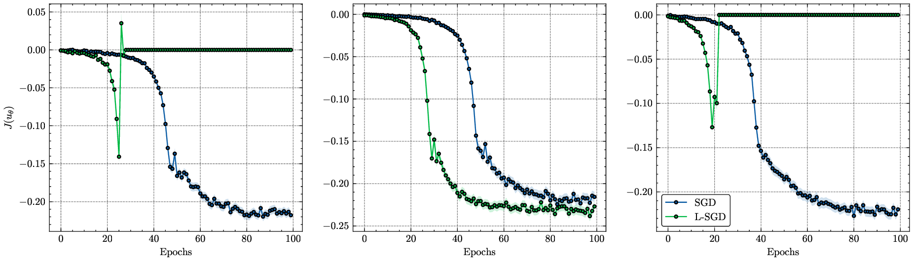 |
|:--:|
| **Comparison of SGD and L-SGD with momentum = 0.9 for $N=30, 50, 100$ over 100 epochs.** The schedules are $\gamma_n =5e-2$ and $\sigma_n=1e-3$ between epochs 0 and 80, after which $\gamma_n$ is divided by 10 and $\sigma$ set to 0. |

| 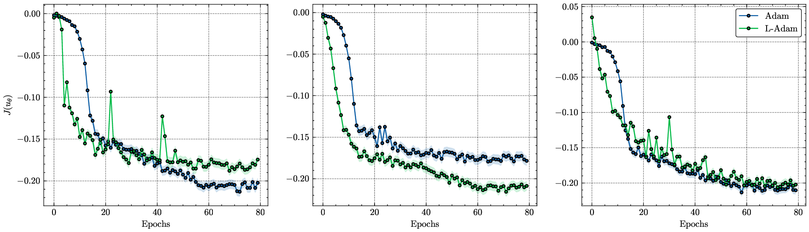 |
|:--:|
| **Comparison of Adam and L-Adam for $N=30, 50, 100$ over 80 epochs.** The schedules are $\gamma_n =2e-3$ and $\sigma_n=1e-3$ between epochs 0 and 60, after which $\gamma_n$ is divided by 10 and $\sigma$ set to 0. |

| 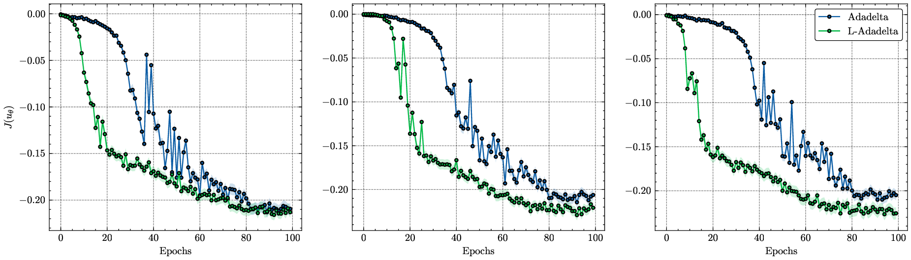 |
|:--:|
| **Comparison of Adadelta and L-Adadelta for $N=30, 50, 100$ over 100 epochs.** The schedules are $\gamma_n =5e-1$ and $\sigma_n=5e-3$ between epochs 0 and 80, after which $\gamma_n$ is divided by 10 and $\sigma$ set to 0. |

The Langevin SGD appears to be unreliable, while Langevin Adadelta, RMSProp, and Adagrad show 
better convergence than their traditional counterparts.

#### Multiple controls

| 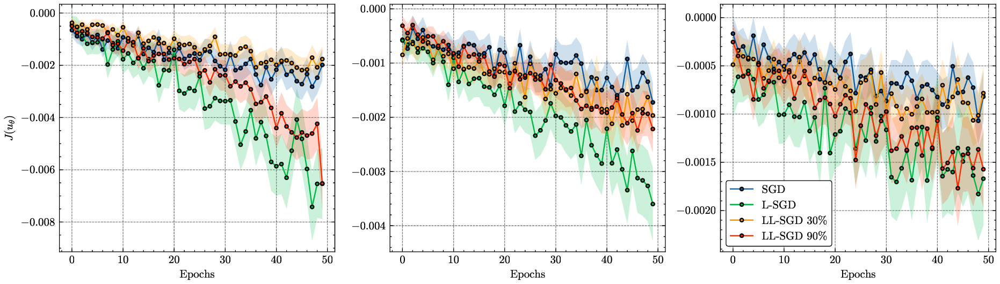 |
|:--:|
| **Comparison of SGD, L-SGD, and LL-SGD with momentum = 0.9 for $N=10, 20, 40$ over 50 epochs.** The schedules are $\gamma_n =5e-2$ and $\sigma_n=2e-3$ between epochs 0 and 40, after which $\gamma_n$ is divided by 10 and $\sigma$ set to 0. |

| 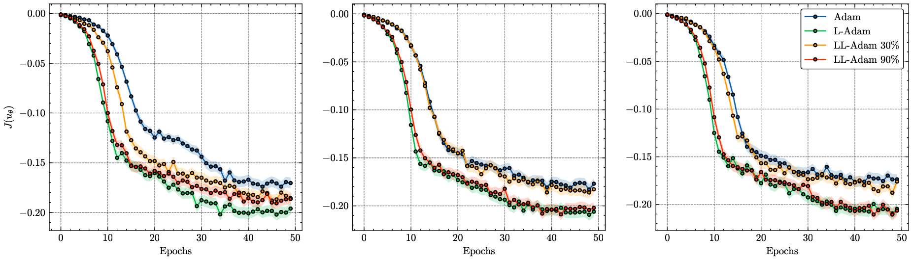 |
|:--:|
| **Comparison of Adam, L-Adam, and LL-Adam for $N=10, 20, 40$ over 50 epochs.** The schedules are $\gamma_n =2e-3$ and $\sigma_n=2e-4$ between epochs 0 and 40, after which $\gamma_n$ is divided by 10 and $\sigma$ set to 0. |

| 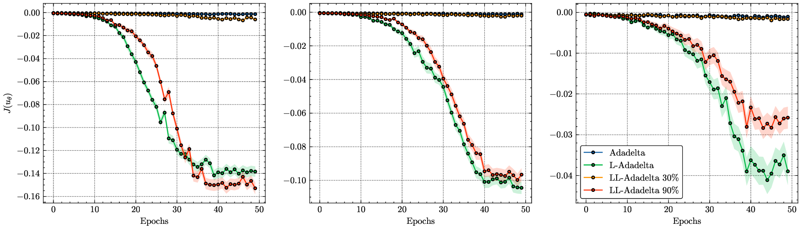 |
|:--:|
| **Comparison of Adadelta, L-Adadelta, and LL-Adadelta for $N=10, 20, 40$ over 50 epochs.** The schedules are $\gamma_n =5e-1$ and $\sigma_n=5e-3$ between epochs 0 and 40, after which $\gamma_n$ is divided by 10 and $\sigma$ set to 0. |

| 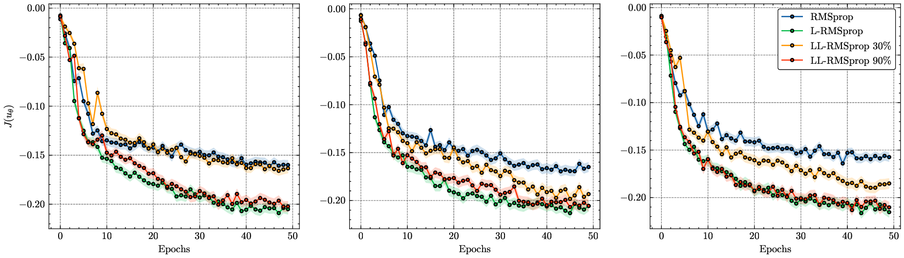 |
|:--:|
| **Comparison of RMSprop, L-RMSprop, and LL-RMSprop for $N=10, 20, 40$ over 50 epochs.** The schedules are $\gamma_n =2e-3$ and $\sigma_n=2e-3$ between epochs 0 and 40, after which $\gamma_n$ is divided by 10 and $\sigma$ set to 0. |

| 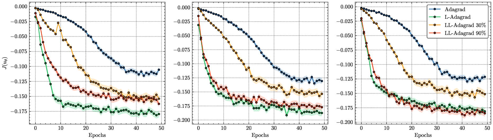 |
|:--:|
| **Comparison of Adagrad, L-Adagrad, and LL-Adagrad for $N=10, 20, 40$ over 50 epochs.** The schedules are $\gamma_n =5e-3$ and $\sigma_n=5e-5$ between epochs 0 and 40, after which $\gamma_n$ is divided by 10 and $\sigma$ set to 0. |

### References
<ol>
  <li id="ref1">Diederik P. Kingma and Jimmy Ba. <i>Adam: A method for stochastic optimization<i>. 2015.</li>

  <li id="ref2">T. Tieleman and G. E. Hinton. <i>Lecture 6.5-rmsprop: Divide the gradient by a running average of its recent magnitude. Coursera: Neural Networks for Machine Learning<i>. 2012.</li>

  <li id="ref3">Matthew D. Zeiler. <i>ADADELTA: An Adaptive Learning Rate Method<i>. 2012.</li>

  <li id="ref4">Chandrasekaran Anirudh Bhardwaj. <i>Adaptively Preconditioned Stochastic Gradient Langevin
Dynamics<i>. 2019.</li>

  <li id="ref5">Pierre Bras. <i>Langevin algorithms for very deep Neural Networks with applications to image classification<i>. 2022.</li>

  <li id="ref6">Pierre Bras and Gilles Pagès. <i>Langevin algorithms for Markovian Neural Networks and Deep Stochastic control<i>. 2023.</li>

  <li id="ref7">Mathieu Laurière, Gilles Pagès, and Olivier Pironneau. <i>Performance of a Markovian neural network versus dynamic programming on a fishing control problem<i>. 2021.</li>

</ol>
</ol>
